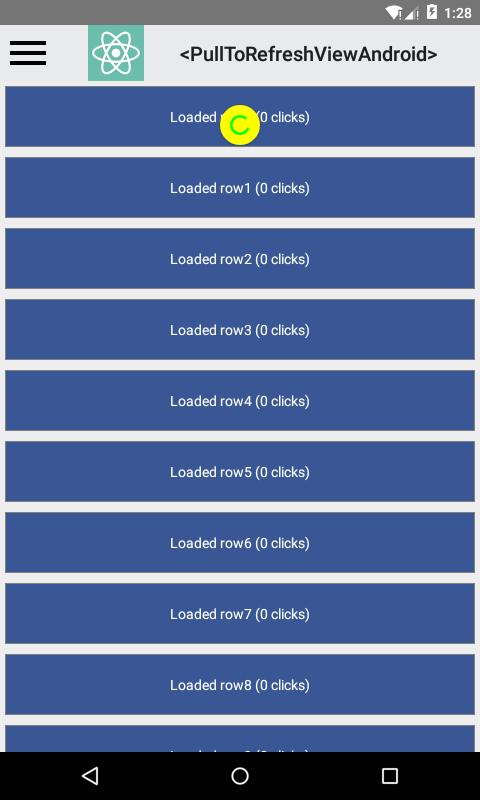

注：此组件将在下个版本被弃用，请使用[RefreshControl](refreshcontrol.html)代替
本组件是一个视图，可以放置单个可滚动子视图（比如ScrollView）。当子视图的竖直方向偏移（scrollY）为0时，将其下拉可以触发一个onRefresh事件。

### 截图


### 属性列表

<div class="props">
    <div class="prop"><h4 class="propTitle"><a class="anchor" name="view"></a><a href="view.html#props">View
        props...</a> <a class="hash-link" href="#view">#</a></h4></div>
    <div class="prop"><h4 class="propTitle"><a class="anchor" name="colors"></a>colors <span
            class="propType">[string]</span> <a class="hash-link" href="#colors">#</a></h4>
        <div><p>指定颜色（至少一种），用于绘制刷新的指示图标</p></div>
    </div>
    <div class="prop"><h4 class="propTitle"><a class="anchor" name="enabled"></a>enabled <span
            class="propType">bool</span> <a class="hash-link" href="#enabled">#</a></h4>
        <div><p>是否开启下拉刷新的功能</p></div>
    </div>
    <div class="prop"><h4 class="propTitle"><a class="anchor" name="progressbackgroundcolor"></a>progressBackgroundColor
        <span class="propType">string</span> <a class="hash-link" href="#progressbackgroundcolor">#</a></h4>
        <div><p>刷新指示图标的背景色</p></div>
    </div>
    <div class="prop"><h4 class="propTitle"><a class="anchor" name="refreshing"></a>refreshing <span class="propType">bool</span>
        <a class="hash-link" href="#refreshing">#</a></h4>
        <div><p>视图是否应该显示刷新指示图标</p></div>
    </div>
    <div class="prop"><h4 class="propTitle"><a class="anchor" name="size"></a>size <span class="propType">RefreshLayoutConsts.SIZE.DEFAULT</span>
        <a class="hash-link" href="#size">#</a></h4>
        <div><p>刷新指示图标的尺寸，请参阅PullToRefreshViewAndroid.SIZE</p></div>
    </div>
</div>

### 例子
```javascript
'use strict';

const React = require('react-native');
const {
  ScrollView,
  StyleSheet,
  PullToRefreshViewAndroid,
  Text,
  TouchableWithoutFeedback,
  View,
} = React;

const styles = StyleSheet.create({
  row: {
    borderColor: 'grey',
    borderWidth: 1,
    padding: 20,
    backgroundColor: '#3a5795',
    margin: 5,
  },
  text: {
    alignSelf: 'center',
    color: '#fff',

  },
  layout: {
    flex: 1,
  },
  scrollview: {
    flex: 1,
  },
});

const Row = React.createClass({
  _onClick: function() {
    this.props.onClick(this.props.data);
  },
  render: function() {
    return (
     <TouchableWithoutFeedback onPress={this._onClick} >
        <View style={styles.row}>
          <Text style={styles.text}>
            {this.props.data.text + ' (' + this.props.data.clicks + ' clicks)'}
          </Text>
        </View>
    </TouchableWithoutFeedback>
    );
  },
});
const PullToRefreshViewAndroidExample = React.createClass({
  statics: {
    title: '<PullToRefreshViewAndroid>',
    description: 'Container that adds pull-to-refresh support to its child view.'
  },

  getInitialState() {
    return {
      isRefreshing: false,
      loaded: 0,
      rowData: Array.from(new Array(20)).map(
        (val, i) => ({text: 'Initial row' + i, clicks: 0})
      ),
    };
  },

  _onClick(row) {
    row.clicks++;
    this.setState({
      rowData: this.state.rowData,
    });
  },

  render() {
    const rows = this.state.rowData.map((row, ii) => {
      return <Row key={ii} data={row} onClick={this._onClick}/>;
    });
    return (
      <PullToRefreshViewAndroid
        style={styles.layout}
        refreshing={this.state.isRefreshing}
        onRefresh={this._onRefresh}
        colors={['#ff0000', '#00ff00', '#0000ff']}
        progressBackgroundColor={'#ffff00'}
        >
        <ScrollView style={styles.scrollview}>
          {rows}
        </ScrollView>
      </PullToRefreshViewAndroid>
    );
  },

  _onRefresh() {
    this.setState({isRefreshing: true});
    setTimeout(() => {
      // prepend 10 items
      const rowData = Array.from(new Array(10))
      .map((val, i) => ({
        text: 'Loaded row' + (+this.state.loaded + i),
        clicks: 0,
      }))
      .concat(this.state.rowData);

      this.setState({
        loaded: this.state.loaded + 10,
        isRefreshing: false,
        rowData: rowData,
      });
    }, 5000);
  },

});


module.exports = PullToRefreshViewAndroidExample;
```
