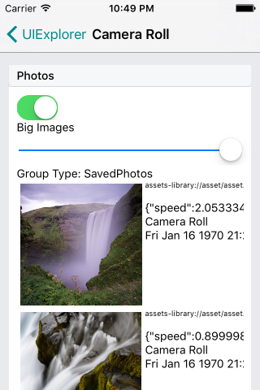

`CameraRoll`模块提供了访问本地相册的功能。

### 截图


### 方法

<div class="props">
	<div class="prop">
		<h4 class="propTitle"><a class="anchor" name="saveimagewithtag"></a><span class="propType">static </span>saveImageWithTag<span class="propType">(tag, successCallback, errorCallback)</span> <a class="hash-link" href="#saveimagewithtag">#</a></h4>
		<div>
			<p>保存一个图片到相册。</p>
			<p>CameraRoll API目前还未实现安卓版本。</p>
			<p>@param {string} tag 在安卓上，本参数是一个本地URI，例如<code>"file:///sdcard/img.png"</code>.</p>
			<p>在iOS设备上可能是以下之一：</p>
			<ul>
				<li>本地URI</li>
				<li>资源库的标签</li>
				<li>非以上两种类型，表示图片数据将会存储在内存中（并且在本进程持续的时候一直会占用内存）。</li>
			</ul>
			<p>@param successCallback 当成功的时候调用，参数为<code>tag</code>。</p>
			<p>@param errorCallback 当失败的时候调用，参数为一个错误信息字符串。</p>
		</div>
	</div>
	<div class="prop">
		<h4 class="propTitle"><a class="anchor" name="getphotos"></a><span class="propType">static </span>getPhotos<span class="propType">(params, callback, errorCallback)</span> <a class="hash-link" href="#getphotos">#</a></h4>
		<div>
			<p> 调用<code>callback</code>回调函数，参数是从设备本地相册中读取的图片对象列表。对象的定义参见<a href="https://github.com/facebook/react-native/blob/master/Libraries/CameraRoll/CameraRoll.js#L84" target="_blank"><code>getPhotosReturnChecker</code></a>。</p>
			<p> @param {object} params 参见<a href="https://github.com/facebook/react-native/blob/master/Libraries/CameraRoll/CameraRoll.js#L46" target="_blank"><code>getPhotosParamChecker</code></a>. </p>
			<p> @param {function} callback 当成功的时候调用，参数对象的定义参见<code>getPhotosReturnChecker</code>。</p>
			<p> @param {function} errorCallback 当失败的时候调用，参数为一个错误信息字符串。</p>
		</div>
	</div>
</div>

### 样例

```javascript
'use strict';

const React = require('react-native');
const {
  CameraRoll,
  Image,
  SliderIOS,
  StyleSheet,
  Switch,
  Text,
  View,
  TouchableOpacity
} = React;

const CameraRollView = require('./CameraRollView');

const AssetScaledImageExampleView = require('./AssetScaledImageExample');

const CAMERA_ROLL_VIEW = 'camera_roll_view';

const CameraRollExample = React.createClass({

  getInitialState() {
    return {
      groupTypes: 'SavedPhotos',
      sliderValue: 1,
      bigImages: true,
    };
  },

  render() {
    return (
      <View>
        <Switch
          onValueChange={this._onSwitchChange}
          value={this.state.bigImages} />
        <Text>{(this.state.bigImages ? 'Big' : 'Small') + ' Images'}</Text>
        <SliderIOS
          value={this.state.sliderValue}
          onValueChange={this._onSliderChange}
        />
        <Text>{'Group Type: ' + this.state.groupTypes}</Text>
        <CameraRollView
          ref={CAMERA_ROLL_VIEW}
          batchSize={20}
          groupTypes={this.state.groupTypes}
          renderImage={this._renderImage}
        />
      </View>
    );
  },

  loadAsset(asset){
    if (this.props.navigator) {
      this.props.navigator.push({
        title: 'Camera Roll Image',
        component: AssetScaledImageExampleView,
        backButtonTitle: 'Back',
        passProps: { asset: asset },
      });
    }
  },

  _renderImage(asset) {
    const imageSize = this.state.bigImages ? 150 : 75;
    const imageStyle = [styles.image, {width: imageSize, height: imageSize}];
    const location = asset.node.location.longitude ?
      JSON.stringify(asset.node.location) : 'Unknown location';
    return (
      <TouchableOpacity key={asset} onPress={ this.loadAsset.bind( this, asset ) }>
        <View style={styles.row}>
          <Image
            source={asset.node.image}
            style={imageStyle}
          />
          <View style={styles.info}>
            <Text style={styles.url}>{asset.node.image.uri}</Text>
            <Text>{location}</Text>
            <Text>{asset.node.group_name}</Text>
            <Text>{new Date(asset.node.timestamp).toString()}</Text>
          </View>
        </View>
      </TouchableOpacity>
    );
  },

  _onSliderChange(value) {
    const options = CameraRoll.GroupTypesOptions;
    const index = Math.floor(value * options.length * 0.99);
    const groupTypes = options[index];
    if (groupTypes !== this.state.groupTypes) {
      this.setState({groupTypes: groupTypes});
    }
  },

  _onSwitchChange(value) {
    this.refs[CAMERA_ROLL_VIEW].rendererChanged();
    this.setState({ bigImages: value });
  }
});

const styles = StyleSheet.create({
  row: {
    flexDirection: 'row',
    flex: 1,
  },
  url: {
    fontSize: 9,
    marginBottom: 14,
  },
  image: {
    margin: 4,
  },
  info: {
    flex: 1,
  },
});

exports.title = 'Camera Roll';
exports.description = 'Example component that uses CameraRoll to list user\'s photos';
exports.examples = [
  {
    title: 'Photos',
    render(): ReactElement { return <CameraRollExample />; }
  }
];
```
