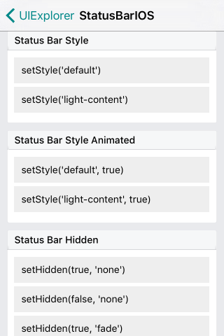

__译注__：本模块用于设置iOS状态的显隐与样式。

### 截图


### 方法


<div class="props">
	<div class="prop"><h4 class="propTitle"><a class="anchor" name="setstyle"></a><span class="propType">static </span>setStyle<span class="propType">(style: StatusBarStyle, animated?: boolean)</span> <a class="hash-link" href="#setstyle">#</a></h4></div>
	<div class="prop"><h4 class="propTitle"><a class="anchor" name="sethidden"></a><span class="propType">static </span>setHidden<span class="propType">(hidden: boolean, animation?: StatusBarAnimation)</span> <a class="hash-link" href="#sethidden">#</a></h4></div>
	<div class="prop"><h4 class="propTitle"><a class="anchor" name="setnetworkactivityindicatorvisible"></a><span class="propType">static </span>setNetworkActivityIndicatorVisible<span class="propType">(visible: boolean)</span> <a class="hash-link" href="#setnetworkactivityindicatorvisible">#</a></h4></div>
</div>

### 例子

```javascript
'use strict';

var React = require('react-native');
var {
  StyleSheet,
  View,
  Text,
  TouchableHighlight,
  StatusBarIOS,
} = React;

exports.framework = 'React';
exports.title = 'StatusBarIOS';
exports.description = 'Module for controlling iOS status bar';
exports.examples = [{
  title: 'Status Bar Style',
  render() {
    return (
      <View>
        {['default', 'light-content'].map((style) =>
          <TouchableHighlight style={styles.wrapper}
            onPress={() => StatusBarIOS.setStyle(style)}>
            <View style={styles.button}>
              <Text>setStyle('{style}')</Text>
            </View>
          </TouchableHighlight>
        )}
      </View>
    );
  },
}, {
  title: 'Status Bar Style Animated',
  render() {
    return (
      <View>
        {['default', 'light-content'].map((style) =>
          <TouchableHighlight style={styles.wrapper}
            onPress={() => StatusBarIOS.setStyle(style, true)}>
            <View style={styles.button}>
              <Text>setStyle('{style}', true)</Text>
            </View>
          </TouchableHighlight>
        )}
      </View>
    );
  },
}, {
  title: 'Status Bar Hidden',
  render() {
    return (
      <View>
        {['none', 'fade', 'slide'].map((animation) =>
          <View>
            <TouchableHighlight style={styles.wrapper}
              onPress={() => StatusBarIOS.setHidden(true, animation)}>
              <View style={styles.button}>
                <Text>setHidden(true, '{animation}')</Text>
              </View>
            </TouchableHighlight>
            <TouchableHighlight style={styles.wrapper}
              onPress={() => StatusBarIOS.setHidden(false, animation)}>
              <View style={styles.button}>
                <Text>setHidden(false, '{animation}')</Text>
              </View>
            </TouchableHighlight>
          </View>
        )}
      </View>
    );
  },
}, {
  title: 'Status Bar Network Activity Indicator',
  render() {
    return (
      <View>
        <TouchableHighlight style={styles.wrapper}
          onPress={() => StatusBarIOS.setNetworkActivityIndicatorVisible(true)}>
          <View style={styles.button}>
            <Text>setNetworkActivityIndicatorVisible(true)</Text>
          </View>
        </TouchableHighlight>
        <TouchableHighlight style={styles.wrapper}
          onPress={() => StatusBarIOS.setNetworkActivityIndicatorVisible(false)}>
          <View style={styles.button}>
            <Text>setNetworkActivityIndicatorVisible(false)</Text>
          </View>
        </TouchableHighlight>
      </View>
    );
  },
}];

var styles = StyleSheet.create({
  wrapper: {
    borderRadius: 5,
    marginBottom: 5,
  },
  button: {
    backgroundColor: '#eeeeee',
    padding: 10,
  },
});
```