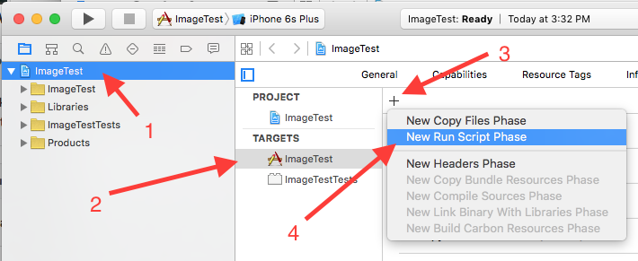
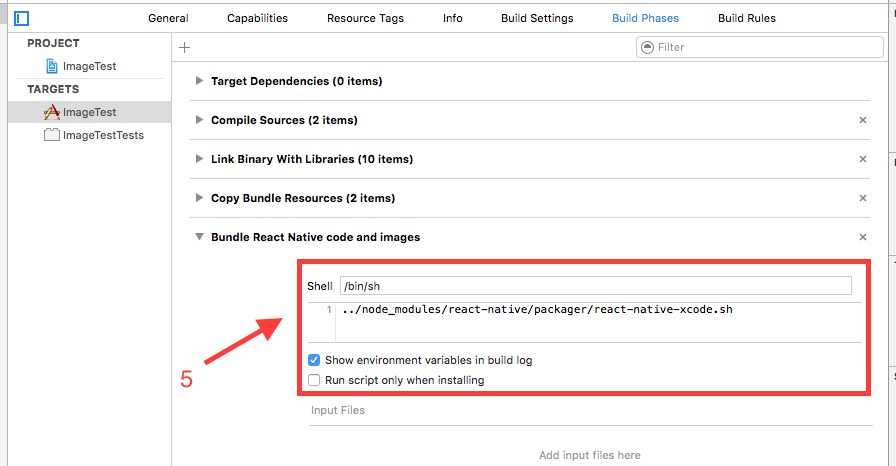
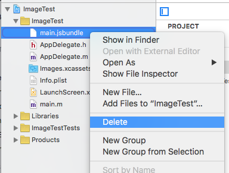

时刻将React Native更新到最新的版本，可以获得更多API、视图、开发者工具以及其他一些好东西（译注：官方开发任务繁重，人手紧缺，几乎不会对旧版本提供维护支持，所以即便更新可能带来一些兼容上的变更，但建议开发者还是尽一切可能第一时间更新）。由于一个完整的React Native项目是由Android项目、iOS项目和JavaScript项目组成的，且都打包在一个npm包中，所以升级可能会有一些麻烦。我们会尽量简化这一流程。以下是目前所需的升级步骤：

## 1. 更新`react-native`的node依赖包

请去下面的网址查看`react-native`的npm包的最新版本：（译注：或使用`npm info react-native`命令查看）

* [https://www.npmjs.com/package/react-native](https://www.npmjs.com/package/react-native)

打开项目目录下的`package.json`文件，然后在`dependencies`模块下找到`react-native`，将其版本号改到最新，然后在命令行中运行（译注：如果提示权限错误，就在命令前加上sudo）： 

```sh
$ npm install
```

## 2. 升级项目模板文件

新版本的npm包通常还会包含一些动态生成的文件，这些文件是在运行`react-native init`创建新项目时生成的，比如iOS和Android的项目文件。为了使老项目的项目文件也能得到更新（不重新init），你需要在命令行中运行：

```sh
$ react-native upgrade
```

这一命令会检查最新的项目模板，然后进行如下操作：

* 如果是新添加的文件，则直接创建。
* 如果文件和当前版本的文件相同，则跳过。
* 如果文件和当前版本的文件不同，则会提示你一些选项：查看两者的不同，选择保留你的版本或是用新的模板覆盖。你可以按下`h`键来查看所有可以使用的命令。


# 手动升级

Xcode项目格式是相当复杂的，所以有些时候需要手工更新和合并一些修改。

### 从0.13升级到0.14

此次更新最大的变化是命令行相关的参数([查看更新日志](https://github.com/facebook/react-native/releases/tag/v0.14.0-rc)) 以及[静态图片的新用法](images.html)。要更新到新的资源系统的话，请执行以下升级步骤：

打开Xcode，在项目的Build Phases中添加新的运行脚本：



将脚本路径设置到
```sh
../node_modules/react-native/packager/react-native-xcode.sh
```



删除现有的main.jsbundle（Xcode会使用上面这个脚本自动生成新的bundle）



如果你是通过nvm安装的Node，那么可能会碰到"react-native: command not found"的错误。请参考[issues/3974](https://github.com/facebook/react-native/issues/3974)中提供的临时方案，以及[pull/4015](https://github.com/facebook/react-native/pull/4015)中提供的补丁。
